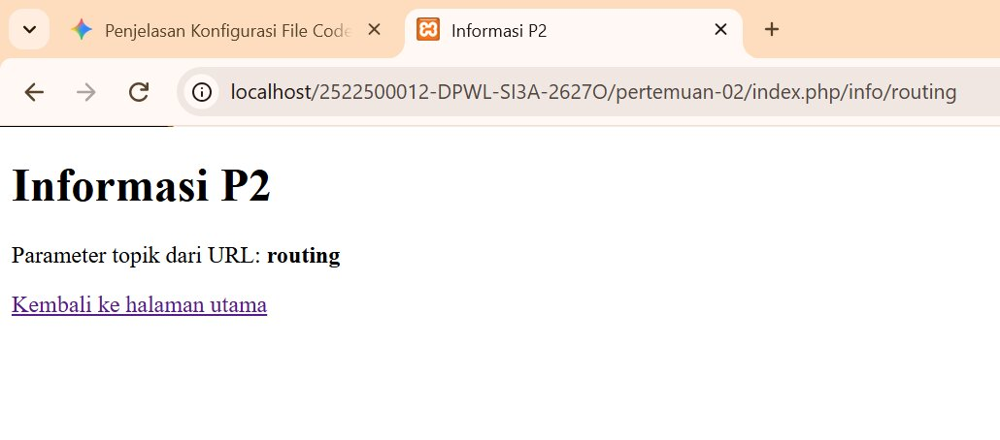
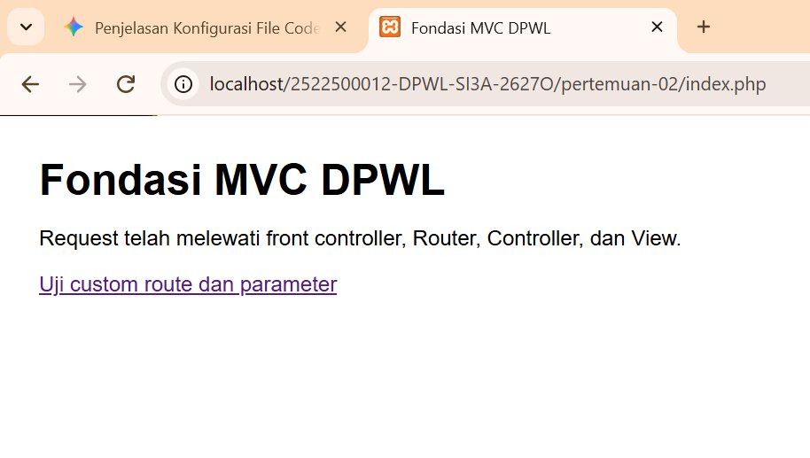
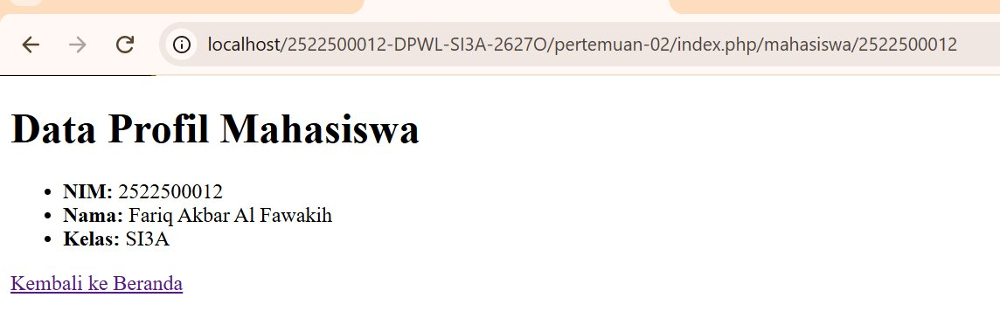

# pertemuan-02
## jawaban 1
Praktikum P2 ini bertujuan untuk memahami alur kerja dasar pola arsitektur MVC (Model-View-Controller) pada kerangka kerja PHP kustom. Selain itu, praktikum ini melatih cara pembuatan rute kustom (*custom routing*) beserta pengiriman parameternya, serta membedakan penerapan fungsi helper `base_url()` untuk memanggil aset statis dan `site_url()` untuk pembentukan link navigasi.

## jawaban 2. Struktur Direktori
```text
pertemuan-02/
├── application/
│   ├── config/
│   │   ├── config.php      -> Mengatur konfigurasi dasar aplikasi (Base URL, dll)
│   │   └── routes.php      -> Mengatur pemetaan rute URL ke Controller
│   ├── controllers/
│   │   └── Home.php        -> Controller utama untuk menangani logika request
│   ├── helpers/
│   │   └── url_helper.php  -> Menyediakan fungsi bantuan base_url() dan site_url()
│   └── views/
│       └── home/
│           ├── index.php   -> View untuk halaman utama (beranda)
│           ├── info.php    -> View untuk menampilkan informasi routing
│           └── mahasiswa.php -> View kustom untuk profil mahasiswa[cite: 1]
├── assets/
│   └── css/
│       └── app.css         -> File stylesheet aset statis[cite: 1]
├── system/                  -> Core framework MVC[cite: 1]
└── index.php               -> Front Controller (pintu masuk utama aplikasi)[cite: 1]

## jawaban 3. Front controller
File index.php yang terletak pada direktori utama bertindak sebagai Front Controller atau satu-satunya titik masuk (single entry point) untuk seluruh request aplikasi[cite: 1].

Ketika pengguna mengakses alamat URL apa pun melalui peramban, seluruh permintaan tersebut akan ditangkap dan dilewatkan terlebih dahulu melalui index.php[cite: 1]. Di dalam file ini, aplikasi memuat konfigurasi awal, memanggil komponen core framework, menginisialisasi sistem routing, hingga akhirnya memanggil controller dan view yang sesuai[cite: 1]. Konsep ini memastikan bahwa eksekusi sistem terpusat, konsisten, dan terstruktur dengan aman[cite: 1].

## jawaban 4. Routing dan Pemetaan URL
| URL/Route | Controller | Method | Parameter | View |
|---|---|---|---|---|
| / | Home | index | - | home/index.php |
| home/index | Home | index | - | home/index.php |
| home/info/mvc | Home | info | mvc | home/info.php |
| info/routing | Home | info | routing | home/info.php |
| mahasiswa/(:num) | Home | mahasiswa | $1 | home/mahasiswa.php |

**Penjelasan Pemetaan Rute Modifikasi ATM:**
- **Route (`mahasiswa/(:num)`):** Menangkap permintaan URL yang diawali kata `mahasiswa/` dan diikuti oleh angka variabel `(:num)` (misalnya NIM `2522500012`).
- **Controller (`Home`):** Menunjuk ke kelas `Home` pada berkas `application/controllers/Home.php`.
- **Method (`mahasiswa`):** Mengeksekusi fungsi/method `mahasiswa()` di dalam Controller `Home`.
- **Parameter (`$1`):** Nilai angka NIM dari URL ditangkap oleh wildcard `(:num)` dan dikirim sebagai argumen ke method `mahasiswa($nim)`.
- **View (`home/mahasiswa.php`):** Controller mengolah data profil (NIM: 2522500012, Nama: Fariq Akbar Al Fawakih, Kelas: SI3A) lalu memuat tampilan akhir pada file View `home/mahasiswa.php`.

| mahasiswa/(:num) | Home | mahasiswa | $1 | home/mahasiswa.php |

**Penjelasan Pemetaan Route Modifikasi ATM:**
- **Route (`mahasiswa/(:num)`):** Menangkap URL yang diawali kata `mahasiswa/` dan diikuti parameter angka `(:num)` (misalnya NIM `2522500012`).
- **Controller (`Home`):** Mengarahkan permintaan ke Controller `Home` (`application/controllers/Home.php`).
- **Method (`mahasiswa`):** Memanggil dan mengeksekusi fungsi `mahasiswa($nim)` di dalam Controller.
- **Parameter (`$1`):** Nilai angka dari URL disalurkan ke argumen variabel `$nim` pada method `mahasiswa`.
- **View (`home/mahasiswa.php`):** Controller menyiapkan data profil (NIM: 2522500012, Nama: Fariq Akbar Al Fawakih, Kelas: SI3A) lalu merender tampilan akhir pada View `home/mahasiswa.php`.

## Jawaban 5.

- **`base_url()`**: Berfungsi untuk menghasilkan URL dasar (*root URL*) proyek yang mengarah ke lokasi folder atau file fisik statis di direktori publik[cite: 1].
  - **Contoh Penggunaan P2:** Memanggil file stylesheet CSS pada file View (`application/views/home/index.php`)[cite: 1]:
    ```php
    <link rel="stylesheet" href="<?= base_url('assets/css/app.css'); ?>">
    ```

- **`site_url()`**: Berfungsi untuk membentuk URL navigasi internal aplikasi yang terintegrasi dengan Front Controller (`index.php`) dan sistem routing[cite: 1].
  - **Contoh Penggunaan P2:** Membentuk link navigasi rute pada View[cite: 1]:
    ```php
    <!-- Navigasi ke rute kustom -->
    <a href="<?= site_url('info/routing'); ?>">Uji custom route</a>

    <!-- Navigasi kembali ke beranda -->
    <a href="<?= site_url(); ?>">Kembali ke Beranda</a>
    ```

---

## Jawaban 6

1. **Alur Eksekusi Aktual P2:**  
   `Browser` $\rightarrow$ `index.php` $\rightarrow$ `Router` $\rightarrow$ `Controller` $\rightarrow$ `View` $\rightarrow$ `Response`  
   *Penjelasan:* Permintaan dari browser ditangkap oleh `index.php` (Front Controller)[cite: 1]. Router memetakan URL ke Controller `Home`[cite: 1]. Controller memproses request, menyiapkan data, lalu memuat file View yang dikembalikan sebagai response tampilan HTML ke browser[cite: 1].

2. **Posisi Model dalam Arsitektur MVC Lengkap:**  
   `Browser` $\rightarrow$ `index.php` $\rightarrow$ `Router` $\rightarrow$ `Controller` $\rightarrow$ `Model` $\rightarrow$ `basis data/data` $\rightarrow$ `Model` $\rightarrow$ `Controller` $\rightarrow$ `View` $\rightarrow$ `Response`  
   *Penjelasan:* Dalam arsitektur lengkap, Controller meminta Model untuk mengambil atau mengolah data dari basis data (MySQL). Setelah data diproses oleh Model dan dikembalikan ke Controller, Controller akan meneruskannya ke View untuk dirender menjadi response.

*Catatan:* Pada implementasi P2, Model belum digunakan karena akses dan pengelolaan basis data baru mulai diimplementasikan pada P3.

---

## Jawaban 7

* **Pengujian Valid:**
  * **Halaman Utama (`/index.php`):** Berhasil memuat beranda lengkap dengan gaya CSS dari `base_url()`[cite: 1].
  * **Navigasi Route (`/info/routing`):** Berhasil berpindah halaman menggunakan fungsi `site_url()`[cite: 1].
  * **Custom Route (`/mahasiswa/2522500012`):** Berhasil menampilkan data profil mahasiswa (NIM: `2522500012`, Nama: `Fariq Akbar Al Fawakih`, Kelas: `SI3A`)[cite: 1].

* **Pengujian Tidak Valid:**
  * **Akses Parameter Non-Angka (`/mahasiswa/abc`):** Halaman menampilkan error/404 karena rute `mahasiswa/(:num)` dikonfigurasi khusus hanya menerima parameter berupa angka (`:num`).

* **Proses Debugging:**
  * **Gejala:** Tampilan data profil pada peramban tidak mengalami perubahan/perbaruan meskipun kodingan pada file Controller telah disesuaikan[cite: 1].
  * **Penyebab:** Berkas kodingan pada VS Code belum tersimpan (*unsaved*) serta adanya *cache* halaman lama pada peramban[cite: 1].
  * **Perbaikan:** Melakukan penyimpanan seluruh berkas (`Ctrl + S`) dan mengeksekusi *hard refresh* (`Ctrl + F5`) pada peramban[cite: 1].
  * **Hasil Uji Ulang:** Halaman web berhasil menampilkan data profil mahasiswa secara dinamis dan diperbarui[cite: 1].

  ## jawaban 8. Bukti Tangkapan Layar

### Gambar 1. Hasil Pengujian Halaman Utama


### Gambar 2. Hasil Pengujian Custom Route Mahasiswa


### Gambar 3. Hasil Pengujian Route Info


## jawaban 9. Kesimpulan P2

Pada praktikum P2 ini, kerangka kerja PHP MVC kustom telah berhasil dipelajari dan diimplementasikan untuk membangun fondasi dasar aplikasi web. Beberapa hal yang sudah dapat dilakukan oleh kerangka kerja MVC pada tahap ini meliputi:
1. **Front Controller (`index.php`):** Mampu menangani seluruh lalu lintas permintaan (*request*) yang masuk sebagai satu titik akses terpusat.
2. **Sistem Routing:** Mampu memetakan URL biasa maupun *custom route* (seperti `/mahasiswa/(:num)`) secara dinamis untuk diteruskan ke Controller dan Method yang sesuai.
3. **Helper (`base_url()` dan `site_url()`):** Mampu mempermudah pemanggilan aset statis (file CSS) dan pembentukan tautan navigasi internal antar-halaman.
4. **Pemisahan Logika dan Tampilan:** Mampu memisahkan antarmuka pengguna (*View*) dari logika proses (*Controller*).

**Pengembangan pada P3:**
Pada P2 ini, komponen **Model** belum digunakan sehingga data yang ditampilkan pada *View* masih bersifat statis (*hardcoded*). Pada praktikum P3 mendatang, kerangka kerja ini akan dilengkapi dengan komponen **Model** untuk menangani integrasi basis data (MySQL), pengelolaan query data, serta pemrosesan data yang dinamis.

